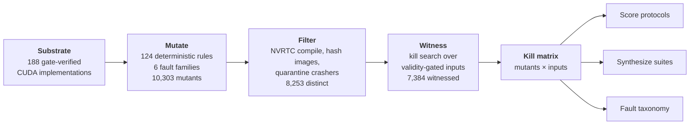

## Overview

A benchmark's correctness checker used to be bookkeeping. For GPU-kernel generation it has become infrastructure that carries load: KernelBench-style verdicts <d-cite key="ouyang2025kernelbench"></d-cite> rank models publicly, gate which generated kernels reach production experiments, and, most consequentially, serve as the reward signal for reinforcement-learning systems that write kernels <d-cite key="baronio2025kevin"></d-cite>. A weak checker in this position fails silently. The model does not learn to write correct kernels; it learns to write kernels that *pass*, and the two diverge exactly where the checker is blind.

The community has noticed. KernelBench-Verified <d-cite key="zhang2026kbv"></d-cite> documents generated kernels that hard-code their way past the official check, adds four hidden input distributions and a tighter tolerance, and reports that headline speedups collapse from 1.43× to 0.88× under the stronger protocol. The Correctness Illusion <d-cite key="sarkar2026illusion"></d-cite> seeds nine bugs by hand and proposes a fuzzing oracle; robust-kbench <d-cite key="lange2025robust"></d-cite> hardens input shapes and timing. Each of these efforts *patches* the checker. None of them can answer the question a benchmark maintainer actually faces: **does my patch cover the faults that matter, and what does it still miss?**

Software engineering solved this measurement problem fifty years ago. Mutation analysis <d-cite key="demillo1978hints,jia2011mutation"></d-cite> scores a test suite by the fraction of small injected faults it detects, turning "is my test suite good?" from opinion into measurement. In our new preprint, [*Measuring the Checker: Mutation Analysis for GPU-Kernel Benchmark Oracles*](/assets/pdf/Kernel_Mutation.pdf), we adapt it to graded numerical oracles and point it at the benchmarks the field is standing on. The short version:

- We inject **10,303** compilable faults into verified CUDA implementations of **188** KernelBench problems. **7,384** of them come with an independent *kill witness*, so only provably detectable faults enter any denominator. Prior art validates against at most ten hand-seeded bugs.
- The official KernelBench check misses **16.9%** of witnessed faults, one in six, deterministically. The misses are skewed by family: 8.7% of arithmetic faults escape, but **78.6%** of precision faults do.
- Two mechanisms explain the blindness: a *tolerance blind band* that grows with reduction size, and a *legitimate-variance ceiling* on how aggressive test inputs may be.
- The metric audits existing patches under their own published parameters. KernelBench-Verified's gain splits into +4.0 points from hidden inputs and +4.5 from tighter tolerance, a split its authors state they cannot compute. A published fuzzing recipe rejects correct kernels 107 times.
- Optimizing suites over the kill matrix reaches **98.0%** detection with two inputs per problem (94.8% held-out), and the measurement's fault taxonomy teaches an LLM test generator more than the raw faults themselves.
- Across 48 whole architectures the blindness grows with scale, concentrating in deep homogeneous pipelines, and two problems prove unrefereeable: their official references violate the benchmark's own tolerance against fp64.

Everything is released as **KernelBench-M**: the mutant pool, the witnesses, the suites, and the pipeline that regenerates every number.

## Two Faults the Official Check Cannot See

Two examples set the tone.

**A zeros-output softmax passes.** One KernelBench problem applies softmax across $$d = 393{,}216$$ elements. Under the official `torch.rand` inputs the reference output averages $$2.5 \times 10^{-6}$$ per element, while the check accepts any output within $$\text{atol} = 10^{-2}$$, four thousand times the signal. A kernel that returns all zeros passes every official trial. This is not an edge case; the blind band widens systematically with reduction size.

**No reseeding can help.** The official inputs are drawn from $$[0, 1)$$. Every element is positive, so deleting a ReLU is the identity on the entire support; $$\exp(x)$$ cannot overflow for $$x < 1$$, so removing softmax's max-subtraction stabilizer is unobservable. Survival under such inputs is a property of the *distribution*, not of sampling luck. More random trials measure the same blindness more confidently.

## Mutation Analysis for Graded Oracles

A benchmark problem supplies a PyTorch reference $$f$$ and an input generator; a submission $$\hat f$$ passes if `allclose(f(x), f̂(x); atol, rtol)` holds on a few draws. We want to score the *protocol*, inputs plus tolerance, by the fraction of faults it detects. Four obstacles separate this domain from classical mutation testing and from test-augmentation work on Python benchmarks such as EvalPlus <d-cite key="liu2023evalplus"></d-cite>.

1. **The oracle is graded.** Detection depends not on behavioural difference but on the ratio of a fault's error to the output magnitude entering the tolerance. At $$d = 64$$ the largest undetectable relative error is 0.39; at $$d = 393{,}216$$ it is $$2.5 \times 10^{3}$$.
2. **Valid inputs are bounded above.** Two correct fp32 kernels legitimately disagree through accumulation order <d-cite key="goldberg1991floating,shanmugavelu2024fp"></d-cite>. On a $$K = 4096$$ reduction, sign-mixed inputs scaled by 300 push a *correct* kernel past the official tolerance, so the input itself becomes invalid, while same-sign inputs of far larger magnitude remain safe because the tolerance scales with the un-cancelled output. Every input-generation scheme for this domain needs a validity gate located by this ceiling. We found none in prior work that has one.
3. **The denominator must be earned.** Some mutants are equivalent (a coherent `blockIdx` permutation relabels independent work); some are real faults no numerical oracle can see (an out-of-bounds write landing in allocator slack). Scoring suites against unkillable rows deflates every protocol equally and informs about none. We admit a mutant into the denominator only with a *kill witness*: a concrete, validity-gated input on which it verifiably fails.
4. **The cost.** Compiling one mutant through the standard torch extension path takes about 200 s; ten thousand mutants would need GPU-years. Runtime compilation via NVRTC brings this to 84 ms, a 500× reduction that makes the kill matrix affordable.

The pipeline that survives these obstacles:



Mutation needs source, and KernelBench's references bottom out in closed cuDNN/cuBLAS binaries, so for each problem we maintain a correct CUDA implementation used only as a mutation target. Substrates are LLM-authored and admitted by an automated gate that checks them against the official reference on every suite; the oracle remains the benchmark's own reference. The 124 rules span six families: classical arithmetic and relational replacements; GPU-specific operators in the lineage of MUTGPU <d-cite key="zhu2020mutgpu"></d-cite> (barrier removal, `__syncthreads` to `__syncwarp`, ceil-to-floor grid division, bounds-guard deletion, fp16 accumulation, index-axis swaps); and LLM-mined fine-grained families (argmax tie-breaking, perturbed polynomial constants, shifted piecewise thresholds). Hashing compiled images, the GPU analogue of Trivial Compiler Equivalence <d-cite key="papadakis2015tce"></d-cite>, removes duplicates and host-only no-ops.

| Stage | Operators (levels 1–2) | Architectures (level 3) |
| :--- | ---: | ---: |
| Problems (substrates) | 188 | 48 |
| Mutants generated | 10,303 | 12,589 |
| − non-compiling | 1,594 | 38 |
| − duplicate compiled image | 279 | 155 |
| − equivalent to original | 177 | 35 |
| Distinct mutants | 8,253 | 12,361 |
| of which witnessed | 7,384 | 8,519 |
| Witnessed mutants missed by the official inputs | 1,248 | 1,476 |
| **Miss rate** | **16.9%** | **17.3%** |

The kill matrix comprises over 120,000 mutant–input evaluations; the whole campaign used roughly 30 GPU-hours on a single H100.

## How Strong Is the Official Check

**Headline.** The official protocol, each problem's own `get_inputs()` with five seeds, detects 6,136 of the 7,384 witnessed faults: **83.1%**. One in six provably-detectable faults survives. Bootstrap resampling over problems shows the pooled rate is a population property, not sampling noise: the 90% band contracts from [8, 29]% at ten problems onto 16.9% at the full set. The per-problem distribution is heavily right-tailed. The median problem loses 10% of its witnessed faults, while a tail dominated by transposed-convolution and reduction problems loses 40–73%.

**Where the misses live.** The gradient across fault families is the paper's central empirical fact.

```echarts
{
  "title": {"text": "Witnessed faults missed by the official check, by family"},
  "color": ["#2a78d6"],
  "tooltip": {"trigger": "axis", "axisPointer": {"type": "shadow"}, "formatter": "{b}: {c}% missed"},
  "grid": {"left": "3%", "right": "12%", "bottom": "3%", "top": "50px", "containLabel": true},
  "xAxis": {"type": "value", "name": "missed (%)", "min": 0, "max": 100},
  "yAxis": {"type": "category", "data": ["Arithmetic (n=3,349)", "Indexing (n=749)", "Semantic (n=858)", "Boundary (n=1,735)", "Synchronization (n=400)", "Precision (n=271)"]},
  "series": [
    {
      "name": "Missed",
      "type": "bar",
      "barWidth": 18,
      "itemStyle": {"borderRadius": [0, 4, 4, 0]},
      "label": {"show": true, "position": "right", "formatter": "{c}%"},
      "data": [8.7, 14.4, 14.9, 22.9, 27.8, 78.6],
      "markLine": {
        "symbol": "none",
        "lineStyle": {"type": "dashed", "color": "#eb6834"},
        "label": {"formatter": "all families: 16.9%", "position": "insideEndTop"},
        "data": [{"xAxis": 16.9}]
      }
    }
  ]
}
```

| Family | Rules | Witnessed | Missed | Example operators |
| :--- | ---: | ---: | ---: | :--- |
| Arithmetic | 5 | 3,349 | 8.7% | `+` to `−`, `*` to `/`, off-by-one constant |
| Indexing | 13 | 749 | 14.4% | axis swap, stride confusion, transposed access |
| Semantic | 18 | 858 | 14.9% | tie-breaking, fused-op reordering, flag flips |
| Boundary | 27 | 1,735 | 22.9% | guard deletion, ceil to floor grid, tail drop |
| Synchronization | 6 | 400 | 27.8% | barrier removal, syncwarp weakening |
| Precision | 27 | 271 | 78.6% | fp16 accumulators, no-stabilizer, fast-math |

Textbook mutations, the operator swaps that dominate classical mutation testing, are caught at 91%: random dense inputs excite arithmetic everywhere, so arithmetic faults have nowhere to hide. The families that escape are precisely the ones real GPU bugs inhabit. Boundary faults hide because official shapes are aligned and remainder blocks never execute. Synchronization faults hide because small aligned workloads rarely lose the race. Precision faults hide because the tolerance forgives them by construction. A checker validated on hand-seeded arithmetic bugs would look excellent and be blind where it matters. At operator granularity the same two regimes recur: storing through an fp16 temporary escapes the tolerance 92% of the time, while barrier weakenings escape at 26–29% because the official aligned shapes never exercise the code they break.

**Mechanisms, quantified.** Three regularities organize the survivors.

- *Vacuity scales with output magnitude.* Softmax contributes 28 tolerance-blind survivors where structurally identical log-softmax contributes 9. Log-domain outputs are $$O(10)$$, which collapses the blind band.
- *The ceiling caps input aggressiveness.* The obvious fix, "test with harsher inputs," is unsound past the measured boundary. Our targeted suites therefore use same-sign magnitudes.
- *Complementarity.* 90 mutants are killed *only* by dense random inputs; under sparse or spiky inputs a wrong index usually reads another zero. Targeted inputs complement rather than replace the official distribution. The empirically optimal suite shape is one dense-random input plus one or two structure-targeted ones, which is exactly what the optimizer below discovers.

## Auditing Hardened Checkers

A metric that can score the official protocol can score its proposed replacements. We re-implement KernelBench-Verified from its released source: four deterministic scalings of each problem's own inputs (×1, ×3, ×0.01, ×−1; shapes never varied; integer tensors never scaled) plus an fp32 tolerance of $$10^{-3}$$. We reconstruct the Correctness-Illusion-style fuzzer from its paper (log-uniform magnitudes spanning six decades; no code is released). All protocols are scored on a unified denominator of 8,215 witnessed mutants across 235 operator- and architecture-level problems, and every protocol includes the original distribution.

```echarts
{
  "title": {"text": "Protocol audit on the unified denominator (8,215 witnessed mutants)"},
  "color": ["#2a78d6"],
  "tooltip": {"trigger": "axis", "axisPointer": {"type": "shadow"}, "formatter": "{b}: {c}% detected"},
  "grid": {"left": "3%", "right": "12%", "bottom": "3%", "top": "50px", "containLabel": true},
  "xAxis": {"type": "value", "name": "detected (%)", "min": 70, "max": 100},
  "yAxis": {"type": "category", "data": ["Official KernelBench (5 inputs)", "KBV inputs, tol 1e-2 (4 inputs)", "CI-style fuzz (3 inputs, 107 false kills)", "KBV full, tol 1e-3 (4 inputs)", "Ours (2 inputs)", "Ours, all targeted (~8 inputs)"]},
  "series": [
    {
      "name": "Detected",
      "type": "bar",
      "barWidth": 18,
      "itemStyle": {"borderRadius": [0, 4, 4, 0]},
      "label": {"show": true, "position": "right", "formatter": "{c}%"},
      "data": [80.0, 84.0, 86.2, 88.5, 98.1, 99.9]
    }
  ]
}
```

**Decomposing KBV.** Of KernelBench-Verified's +8.5 points over the official protocol, +4.0 come from the four hidden distributions and +4.5 from the tighter tolerance. The tolerance change outweighs all four designed distributions combined. Their paper reports the same asymmetry from the outside and states that it "does not quantify how many failures were solely attributable to tighter tolerance versus distributional mismatches." The kill matrix computes precisely this.

**Why constant scalings plateau.** All four KBV transforms rescale magnitude; none varies shape or structure. Remainder-block boundary faults and index-arithmetic faults are therefore unreachable *by construction*, independent of how many scaled configurations are added, and these are exactly the families the official check already misses most. This is the kind of blind spot invisible to anecdote-based validation and obvious under a metric. Collapsing the kill matrix to its distinct miss-patterns makes the band's core visible: 643 mutants that every baseline misses and only our targeted suite detects.

**The fuzz baseline crosses the ceiling.** The reconstructed fuzzer buys its 86.2% partly with invalid inputs: at the top of its magnitude range it rejected correct kernels 107 times in our audit. Detection bought with invalid inputs is not detection; a deployed benchmark would be rejecting honest submissions.

**A cautionary replication note.** An early version of our own audit guessed $$\mathcal{N}(0,1) \times 10^{4}$$ for KBV's large-magnitude distribution and observed false rejections of correct kernels. The fault was our guess, not their protocol: their published ×3 cannot cross the ceiling. We keep the episode on record because it argues the thesis better than any experiment we designed. Without a measured validity gate, an input designer, human or model, cannot tell when they have crossed it.

## From Measurement to Synthesis

**Suites as set cover.** Once the kill matrix exists, suite construction is the classical covering problem <d-cite key="harrold1993methodology,yoo2012regression"></d-cite>. Greedy cover reaches full coverage of witnessed mutants with a median of **two inputs per problem**: one dense-random plus one targeted input suffice for 86 of the 152 problems with a non-trivial witnessed pool, and no problem needs more than six.

```echarts
{
  "title": {"text": "Detection vs. input budget (greedy set cover on the kill matrix)"},
  "color": ["#2a78d6", "#eb6834"],
  "tooltip": {"trigger": "axis"},
  "legend": {"top": "30px", "data": ["Optimized, full pool", "Optimized, held-out mutants"]},
  "grid": {"left": "3%", "right": "6%", "bottom": "3%", "top": "70px", "containLabel": true},
  "xAxis": {"type": "value", "name": "inputs per problem", "min": 1, "max": 5, "interval": 1},
  "yAxis": {"type": "value", "name": "witnessed faults detected (%)", "min": 80, "max": 100},
  "series": [
    {
      "name": "Optimized, full pool",
      "type": "line",
      "symbolSize": 8,
      "lineStyle": {"width": 2},
      "data": [[1, 87.1], [2, 98.0], [3, 99.5], [5, 100.0]],
      "markLine": {
        "symbol": "none",
        "lineStyle": {"type": "dashed", "color": "#888888"},
        "label": {"formatter": "official, 5 random inputs: 83.1%", "position": "insideEndTop"},
        "data": [{"yAxis": 83.1}]
      }
    },
    {
      "name": "Optimized, held-out mutants",
      "type": "line",
      "symbolSize": 8,
      "lineStyle": {"width": 2, "type": "dashed"},
      "data": [[1, 84.5], [2, 94.8], [3, 96.4], [5, 96.6]]
    }
  ]
}
```

| Scored on | b = 1 | b = 2 | b = 3 | b = 5 | Official (5 random) |
| :--- | ---: | ---: | ---: | ---: | ---: |
| Full pool | 87.1% | 98.0% | 99.5% | 100.0% | 83.1% |
| Held-out mutants | 84.5% | 94.8% | 96.4% | 96.6% | 82.9% |

To rule out overfitting the selection to the measured pool, we split each problem's witnessed mutants 50/50 by id-hash, select on the dev half only, and score on the test half. Dev-selected suites detect 94.8% of held-out mutants at budget two, a roughly 3-point generalization gap, indicating the chosen inputs capture fault *families*, not memorized individuals. At the official five-input budget an optimized suite detects every witnessed mutant. The gain is chosen testing, not more testing.

**What must a generator know?** Our targeted suites were written by an LLM given three artifacts of the measurement: the blind-spot taxonomy, a per-family attack playbook, and the validity ceiling. They killed 431 previously-unkilled mutants at a 94% suite-validity rate, and the 6% of suites the gate rejected were precisely ceiling violations. To isolate how much of this is the metric's contribution, we fix a hard target (1,154 mutants that survive all official inputs, across 30 problems) and vary only the generator's knowledge.

```echarts
{
  "title": {"text": "Knowledge ladder: share of 1,154 official-input survivors killed"},
  "color": ["#2a78d6"],
  "tooltip": {"trigger": "axis", "axisPointer": {"type": "shadow"}, "formatter": "{b}: {c}% of survivors killed"},
  "grid": {"left": "3%", "right": "4%", "bottom": "3%", "top": "50px", "containLabel": true},
  "xAxis": {"type": "category", "data": ["R0: random fuzz", "R1: naive prompt", "R2: + taxonomy & ceiling", "R3: + white-box diffs"]},
  "yAxis": {"type": "value", "name": "survivors killed (%)", "min": 0, "max": 70},
  "series": [
    {
      "name": "Survivors killed",
      "type": "bar",
      "barWidth": 36,
      "itemStyle": {"borderRadius": [4, 4, 0, 0]},
      "label": {"show": true, "position": "top", "formatter": "{c}%"},
      "data": [21.6, 42.9, 61.0, 57.3]
    }
  ]
}
```

| Rung | Generator knows | Survivors killed | Validity |
| :--- | :--- | ---: | :--- |
| R0 random fuzz | nothing | 21.6% | 107 false kills |
| R1 naive prompt | "tests may miss subtle bugs" | 42.9% | 60/60 |
| R2 + taxonomy & ceiling | fault families, safe magnitudes | 61.0% | 94% (accumulated) |
| R3 + white-box diffs | the mutated source sites | 57.3% | 55/56 |

Two readings matter. First, each increment of measurement-derived knowledge buys detection; the taxonomy nearly triples the fuzz baseline. Second, white-box access to the faults themselves does *not* beat the taxonomy: shown ten concrete mutants, the generator overfits its inputs to them, while family-level knowledge generalizes to the whole pool. The measurement's abstraction is worth more than its raw instances, which is what makes these prompted rungs a credible floor for a learned generator whose reward is the kill rate computed here.

## Does Depth Hide Faults

Level-3 KernelBench problems are whole architectures. Their substrates are multi-kernel pipelines, one `__global__` per layer and 2 to 140 kernels deep, so every mutant carries a layer tag and a question inaccessible at operator scale becomes measurable: does an early fault reach the network output?

Architecture-level checking is weaker on every accounting. Under strict witnessed accounting, 17.3% of architecture-level faults escape the official inputs against 16.9% at operator scale, and this is a floor, since the level-3 witness search is far shallower. The distinct-mutant upper bound is 1.7×: 43.0% survival versus 25.7%.

```echarts
{
  "title": {"text": "Survival by injection depth across 48 architectures (distinct-mutant accounting)"},
  "color": ["#2a78d6"],
  "tooltip": {"trigger": "axis", "axisPointer": {"type": "shadow"}, "formatter": "{b}: {c}% surviving"},
  "grid": {"left": "3%", "right": "4%", "bottom": "3%", "top": "50px", "containLabel": true},
  "xAxis": {"type": "category", "name": "injection depth quartile", "data": ["Q1 (n=5,745)", "Q2 (n=2,390)", "Q3 (n=2,489)", "Q4 (n=1,401)"]},
  "yAxis": {"type": "value", "name": "mutants surviving (%)", "min": 0, "max": 60},
  "series": [
    {
      "name": "Surviving",
      "type": "bar",
      "barWidth": 36,
      "itemStyle": {"borderRadius": [4, 4, 0, 0]},
      "label": {"show": true, "position": "top", "formatter": "{c}%"},
      "data": [44, 49, 42, 39],
      "markLine": {
        "symbol": "none",
        "lineStyle": {"type": "dashed", "color": "#eb6834"},
        "label": {"formatter": "operator scale: 25.7%", "position": "insideEndTop"},
        "data": [{"yAxis": 25.7}]
      }
    }
  ]
}
```

Within networks, faults injected in the front half survive at 44–49%, falling to 39% in the output quartile: a modest but consistent gradient. More telling than either aggregate is the per-architecture structure.

| Architecture | Character | Survival (distinct) |
| :--- | :--- | ---: |
| VGG-19 | deep homogeneous conv chain | 90% |
| SqueezeNet | deep homogeneous | 90% |
| LSTM stacks | long recurrent chains | 77–87% |
| 17-layer MLP | homogeneous | 82% |
| ResNet-18 (51 kernels) | normalization- and branch-dense | 11% |
| SwinMLP (71 kernels) | normalization- and branch-dense | 14% |

Deep homogeneous pipelines are near-opaque to the official check, while architectures dense in normalization and branching stay comparatively transparent even at extreme depth. The per-architecture median of 25.7% matches the operator scale exactly, so the aggregate gap is carried entirely by the homogeneous tail. Depth supplies the *opportunity* for masking; homogeneity, long chains without renormalization, *realizes* it. The direction of travel for the field, from single operators toward end-to-end generated models, is precisely the direction in which its oracles weaken.

**Two problems no oracle can referee.** The two level-3 problems our admission gate could never pass turn out to be unpassable in principle. For `48_Mamba2ReturnY`, whose reference exponentiates cumulative sums of unbounded random parameters, outputs reach $$10^{20}$$ and the official fp32 forward violates the benchmark tolerance against its own fp64 evaluation at 352 positions. For `45_UNetSoftmax`, whose blocks chain softmax into batch normalization, a variance amplifier, the official fp32 forward deviates from fp64 by up to 0.74 (9,379 violations), farther than our rejected candidate sits from the reference. No fp32 implementation, including the reference itself, can be adjudicated on these problems. No prior audit noticed: KernelBench-Verified ships hidden tests for both (its validity filter catches only NaN/Inf, and finite $$10^{20}$$ outputs pass), robust-kbench's filters never touch level 3, and the instability of the naive Mamba segment-sum is acknowledged upstream but had not been connected to the benchmark. Scores reported on these two problems are noise, a concrete instance of what patching without measuring cannot see.

## Limitations

- **Adequacy is relative to a fault model.** Our 124 rules over naive substrates cannot express faults living in structures we do not generate (tensor-core paths, double-buffered pipelines, some warp-level idioms), nor multi-site interactions. The metric licenses comparative claims (suite A misses faults suite B catches) and existence claims (this protocol misses these witnessed faults). It cannot certify a passing kernel correct, and we never use it to.
- **Realism probe.** As a first direct check on the fault model, we prompted an LLM to write leaderboard-style optimized kernels (tiling, `float4`, warp shuffles; no taxonomy shown) for 60 random problems and gated them against the official reference. Three were incorrect: a compile error; a misaligned-address crash from an unguarded vectorized load, squarely in our boundary/guard family; and a value error in a fused GEMM–GroupNorm, matching our accumulation/semantic families. The bug sample is small, but both runtime bugs fall inside the taxonomy. The exercise also exposed a harness blind spot that only realistic style triggers (`__launch_bounds__`-qualified kernels defeating naive `extern "C"` injection), which is the checker-measurement lesson applied to our own tooling.
- **Scope.** Substrates are LLM-authored and gate-verified rather than sampled from submissions; results are from one GPU generation (H100). The level-3 study covers 48 of 50 architectures, and its witness search is shallower than at operator scale, so it is reported as a one-sided bound. The tolerance is fixed at the benchmark's own $$10^{-2}$$ by design, with the audit above isolating the effect of changing it.

## Takeaways

Benchmarks for generated GPU kernels have been patching their correctness checkers blind. Mutation analysis, adapted to graded numerical oracles with a witnessed denominator, a measured validity ceiling, and tractable compilation, turns checker quality into a number, explains the number through two mechanisms and a six-family taxonomy, prices existing patches, and converts suite design into optimization that generalizes to held-out faults.

If you maintain a kernel benchmark, or train a model against one, three things carry over directly:

1. **Measure before you patch.** A patch that looks decisive on ten hand-seeded bugs can leave entire fault families unreachable by construction. The kill matrix tells you what a protocol still misses, and why.
2. **Respect the ceiling.** "Harsher inputs" is not a free lunch. Past the legitimate-variance ceiling, a test rejects correct kernels, and a generator without a validity gate cannot tell when it has crossed it.
3. **Ship the taxonomy, not the mutants.** Family-level knowledge of where the checker is blind generalizes; concrete fault instances invite overfitting. The measurement's most useful by-product is the abstraction it produces.

We release the pool, witnesses, suites, and pipeline as KernelBench-M, so that the next patch to a kernel benchmark can ship with its coverage measured rather than asserted. The full paper is available [here](/assets/pdf/Kernel_Mutation.pdf).
